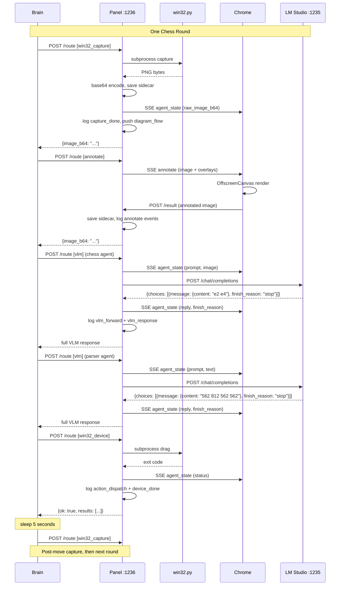

# README.md

```markdown
# FranzAi-Plumbing

**A dumb plumbing system that lets AI agents control a Windows desktop.**

This project does not try to be smart. It moves data between components, keeps everything visible, and lets the AI swarm figure things out over time. When something breaks, you can see exactly where and why.

---

## What This Is

Five independent files. Each one does one job. Together they form a pipeline:

1. A **brain** looks at the screen and asks an AI what to do
2. A **panel** routes every request through the right pipe
3. A **viewer** shows every packet of data flowing through the system in real time
4. A **win32 tool** captures the screen and moves the mouse
5. An **AI model** (LM Studio) answers questions about what it sees

No file imports another file except `brain_util.py` (the SDK). Every component talks to every other component through HTTP or subprocess calls. You can replace any file without touching the others.

---

## Architecture

```mermaid
graph TB
    subgraph BRAIN["Brain Process (Python)"]
        CHESS["chess agent"]
        PARSER["parser agent"]
    end

    subgraph PANEL["Panel :1236 (HTTP Router)"]
        ROUTE["/route endpoint"]
        SSE["/agent-events SSE"]
        LOG["panel_log.jsonl"]
        SIDECAR["panel_images/*.b64"]
    end

    subgraph VIEWER["Chrome Browser"]
        SVG["SVG PCB Diagram"]
        CANVAS["OffscreenCanvas<br/>Annotation Engine"]
        ELOG["Event Log"]
    end

    VLM["LM Studio :1235<br/>Vision AI Model"]
    WIN32["win32.py<br/>Screen + Mouse + Keyboard"]

    CHESS -->|"capture, vlm, device"| ROUTE
    PARSER -->|"vlm"| ROUTE
    ROUTE -->|"HTTP proxy"| VLM
    VLM -->|"response"| ROUTE
    ROUTE -->|"subprocess"| WIN32
    WIN32 -->|"PNG / exit code"| ROUTE
    ROUTE -->|"SSE annotate"| CANVAS
    CANVAS -->|"POST /result"| ROUTE
    ROUTE -->|"SSE agent_state"| SVG
    ROUTE -->|"SSE diagram_flow"| SVG
    ROUTE -->|"every event"| LOG
    ROUTE -->|"images"| SIDECAR
    LOG -->|"replay mode"| SSE
    SIDECAR -->|"replay images"| SSE

    style BRAIN fill:#1a2e1a,stroke:#3ecf8e
    style PANEL fill:#1a1a2e,stroke:#c084fc
    style VIEWER fill:#2e2a1a,stroke:#f0a000
    style VLM fill:#1a2a3e,stroke:#4a9eff
    style WIN32 fill:#2e1a1a,stroke:#ff4455
```



---

## What Changed From the Original

### Before (5-agent chess brain)
- 5 agents (tactics, positional, attacker, defender, arbiter) running in threads
- ~18-20 HTTP round-trips per chess round
- ~15 `ui_status` calls per round that nobody could see (viewer dropped them)
- Regex parsing of VLM output in Python
- Proposal voting system with arbiter
- `finish_reason` logged but never checked
- 1-second delay between moves
- `ui_vlm_cycle()` dead code
- Single arrow per infrastructure node in viewer
- Packets vanished after 0.5 seconds

### After (2-agent pipeline brain)
- 2 agents (chess + parser) in a simple sequential loop
- 6 HTTP round-trips per chess round
- Zero status spam (panel already sees everything it routes)
- VLM does ALL interpretation (chess agent suggests move, parser agent converts to coordinates)
- No regex, no proposal voting, no arbiter
- `finish_reason` checked: truncated replies are discarded
- 5-second delay between moves
- All dead code removed
- Multiple pins per infrastructure node with labeled traces
- GSAP-powered 1.5-second packet animations with fade-out trails
- Scrollable event log showing every operation

### Traffic Reduction

| Metric | Before | After |
|--------|--------|-------|
| HTTP round-trips per round | ~20 | 6 |
| VLM calls per round | 3-5 | 2 |
| Status messages per round | ~15 | 0 |
| Brain file lines | ~250 | ~120 |
| brain_util.py lines | ~270 | ~210 |

---

## The Five Files

### `panel.py` — The Router

Central HTTP server on port 1236. Every request from the brain goes through `/route`. Panel does not decide anything. It just:

- Routes capture requests to `win32.py` (subprocess)
- Routes VLM requests to LM Studio (HTTP proxy)
- Routes annotation requests to Chrome (SSE + POST round-trip)
- Routes device actions to `win32.py` (subprocess)
- Intercepts every operation to extract images, prompts, and replies
- Pushes agent state to the viewer via SSE
- Logs every event to `panel_log.jsonl`
- Saves images to `panel_images/` as sidecar files

**Replay mode:** `python panel.py --replay panel_log.jsonl` reads the log file and replays all events through the same SSE infrastructure. The viewer works identically in live and replay mode. Transport controls: play, pause, step, stop, seek, speed.

### `panel.html` — The Viewer

Full-screen SVG PCB diagram served by panel.py. Shows:

- **Infrastructure chips** (Panel, VLM, win32, Chrome) with multiple pins per chip
- **Agent chips** that appear dynamically when new agents are seen
- **Animated packets** traveling along traces between pins (1.5s GSAP animations)
- **Event log** showing every operation with timestamp, type, agent, and label
- **Finish reason badges** (green for "stop", red for "length")
- **Annotation co-processor** using OffscreenCanvas for drawing overlays on images

Uses GSAP from CDN for smooth GPU-accelerated animations. Chrome-only, no legacy support.

### `brain_util.py` — The SDK

Stateless library imported by brain files. Provides:

- `capture()` — screenshot via win32
- `annotate()` — draw overlays via browser round-trip
- `vlm_text()` — ask VLM, get `(content, finish_reason)` tuple
- `device()` — mouse/keyboard actions via win32
- `make_vlm_request_with_image()` — build OpenAI-compatible request with image
- `make_grid_overlays()` — generate grid overlay for annotation

No status messaging. No push. No backchannel. The brain just does operations and the panel sees everything.

### `brain_chess_players.py` — The Chess Brain

Simple sequential loop:

1. Capture the board
2. Annotate with grid overlay
3. Ask VLM "what move?" (chess agent, 12 tokens max)
4. Ask VLM "convert to coordinates" (parser agent, 30 tokens max)
5. Execute drag action
6. Wait 5 seconds
7. Repeat

Two VLM calls per round. No threading. No regex. No voting. If any step fails, wait 5 seconds and retry.

### `win32.py` — The Windows Tool

Standalone CLI for Win32 operations via ctypes. Commands: capture, click, double_click, right_click, type_text, press_key, hotkey, scroll_up, scroll_down, drag, cursor_pos, select_region. All coordinates in normalized 0-1000 space.

---

## Detailed Data Flow



---

## Panel Endpoint Reference

```mermaid
graph LR
    subgraph "POST endpoints"
        R["/route<br/>Central router"]
        RES["/result<br/>Annotation return"]
        CTL["/control<br/>Replay transport"]
        PL["/panel-log<br/>Client debug log"]
    end

    subgraph "GET endpoints"
        ROOT["/<br/>Serves panel.html"]
        READY["/ready<br/>Health + replay flag"]
        SSE["/agent-events?agent=X<br/>SSE stream"]
        STAT["/status<br/>Replay progress"]
    end

    style R fill:#2a1a3a,stroke:#c084fc
    style SSE fill:#1a2a3a,stroke:#4a9eff
```



| Endpoint | Method | Purpose |
|----------|--------|---------|
| `/route` | POST | Central router. Accepts `{agent, recipients, ...}`. Dispatches to win32_capture, annotate, vlm, win32_device, or async push. |
| `/result` | POST | Browser returns annotated image here. Unblocks the waiting annotate call. |
| `/control` | POST | Replay transport: play, pause, step, stop, seek, speed. |
| `/panel-log` | POST | Accept and discard. For brain debug logging. |
| `/` | GET | Serves panel.html. |
| `/ready` | GET | Returns `{ok, region, scale, ui_connected, replay}`. |
| `/agent-events` | GET | SSE stream. Query param `agent=<name>`. Events: connected, agent_state, annotate, message, diagram_flow, replay_status. |
| `/status` | GET | Replay progress: `{replay, total, index, speed, paused}`. |

---

## Replay System

Every operation that flows through panel.py is logged to `panel_log.jsonl`. Each line is one JSON object:

```json
{"ts": 1773668616.5, "event": "vlm_response", "from": "vlm", "to": "panel",
 "agent": "chess", "request_id": "abc-123", "label": "reply chess (stop)",
 "size": 0, "error": false, "finish_reason": "stop",
 "fields": {"vlm_reply": "e2 e4"}}
```

Images are saved as sidecar files in `panel_images/<request_id>_<tag>.b64`.

To replay:

```
python panel.py --replay panel_log.jsonl
```

Then open `http://127.0.0.1:1236` in Chrome. The viewer shows the same diagram with the same animations, driven by the log file instead of live operations. Use the transport controls at the bottom to play, pause, step through events, seek to any position, or change playback speed.

**Seek** rebuilds cumulative state by replaying all events from 0 to N-1 before jumping to position N. This means agent chips show the correct images and text at any point in the replay.

### Future Replay Improvements

- Annotation images are saved as sidecars but not pushed to agent chips during replay (the browser does not re-render overlays in replay mode). Adding this would show annotated images in the chip during replay.
- The event log could support filtering by agent, event type, or error status.
- Packet animations during fast-forward could be batched or simplified for performance.

---

## Key Protocols

- **Coordinates:** All positions are in normalized 0-1000 space. `(0,0)` is top-left, `(1000,1000)` is bottom-right.
- **Sentinel:** The string `"NONE"` means "no value" everywhere in the system.
- **VLM format:** OpenAI-compatible `/chat/completions` with `image_url` content type for images.
- **`vlm_text()` return:** Always a tuple `(content, finish_reason)`. Check `finish_reason == "length"` for truncation.
- **`device()` return:** `{ok: bool, results: [{type, ok, pos?}]}`.
- **Annotation round-trip:** brain `annotate()` -> panel SSE -> browser OffscreenCanvas -> POST `/result` -> panel unblocks caller.
- **Sidecar storage:** `panel_images/<request_id>_<tag>.b64`. Tags: `raw_image_b64`, `vlm_image_b64`, `annotate_input`, `annotate_output`.

---

## How to Run

1. Start LM Studio on port 1235 with a vision model loaded
2. Run: `python panel.py brain_chess_players.py`
3. Select the screen region containing the chess board
4. Select a horizontal reference for scale
5. Open `http://127.0.0.1:1236` in Chrome
6. Watch the system play chess

---

## Requirements

- Python 3.13
- Windows 11
- Latest Google Chrome
- LM Studio running on port 1235
```

---

# Claude Opus 4.6 Review Prompt

Below is the prompt to paste into a fresh conversation. It is self-contained and requires no history.

````markdown
<role>
You are Claude Opus 4.6 acting as a senior reviewer and co-developer for FranzAi-Plumbing, a multi-agent visual AI system for Windows 11.

Your job is to inspect individual files from this codebase, verify correctness, identify bugs, suggest improvements, and write code when asked. Each file is independent. You may receive one file or several across multiple messages.
</role>

<project_overview>
FranzAi-Plumbing is a "dumb plumbing" system. Five independent files form a pipeline where AI agents control a Windows desktop by looking at the screen, asking a vision model what to do, and executing mouse/keyboard actions.

The system does NOT aim for perfect AI outputs. The goal is: don't crash, keep data flowing, keep errors visible, avoid waste, let the agent swarm figure things out over time.

When reviewing, prioritize data flow correctness, error visibility, and waste elimination over AI quality.
</project_overview>

<architecture>
FIVE FILES, EACH INDEPENDENT:

1. panel.py - Central HTTP server on :1236. Single POST /route endpoint multiplexes to: win32_capture (subprocess), annotate (browser round-trip via SSE), vlm (HTTP proxy to LM Studio :1235), win32_device (subprocess). Panel intercepts every operation to maintain per-agent UI state via _update_agent_state(). Every event is logged to panel_log.jsonl as one JSON object per line. Images saved as sidecar files in panel_images/. Replay mode: python panel.py --replay panel_log.jsonl replays events through same SSE infrastructure.

2. panel.html - Full-screen SVG PCB diagram served by panel.py. Infrastructure chips (Panel, VLM, win32, Chrome) have multiple pins. Agent chips appear dynamically. GSAP (loaded from CDN) animates data packets along SVG path traces for 1.5 seconds. OffscreenCanvas handles annotation rendering. Event log panel shows recent events. Finish reason shown as colored badges. Draggable and resizable chips via foreignObject. Chrome-only, latest version.

3. brain_util.py - Stateless SDK library imported by brain files. Functions: capture(), annotate(), vlm(), vlm_text(), device(). vlm_text() returns tuple[str, str] (content, finish_reason). make_vlm_request_with_image() builds OpenAI-compatible requests. No status messaging, no push, no backchannel. Brain just does operations and panel sees everything.

4. brain_chess_players.py - Example brain. Simple sequential loop: capture -> annotate with grid -> ask VLM for chess move (12 tokens) -> ask parser VLM to convert to coordinates (30 tokens) -> execute drag -> sleep 5s -> repeat. Two agents: "chess" and "parser". No threading, no regex, no voting. If any step fails or finish_reason is "length", sleep and retry.

5. win32.py - Standalone CLI for Win32 operations via ctypes. Commands: capture, click, double_click, right_click, type_text, press_key, hotkey, scroll_up, scroll_down, drag, cursor_pos, select_region. All coordinates in normalized 0-1000 space. All constants in frozen dataclasses.

EXTERNAL: LM Studio on :1235, OpenAI-compatible API, not part of codebase.
</architecture>

<protocols>
COORDINATES: All positions use normalized 0-1000 space. (0,0) is top-left, (1000,1000) is bottom-right. NORM=1000 constant.

SENTINEL: The string "NONE" means "no value" everywhere. Never null, never empty string, always the literal string "NONE".

VLM REQUESTS: OpenAI /chat/completions format with image_url content type. Brain can override max_tokens per call via **overrides parameter.

VLM RESPONSE: vlm_text() returns (content, finish_reason) tuple. MUST check finish_reason == "length" for truncation. Truncated replies should be discarded.

DEVICE RETURN: {ok: bool, results: [{type, ok, pos?}]}

ANNOTATION ROUND-TRIP: brain annotate() -> panel SSE "annotate" event -> browser OffscreenCanvas renders overlays -> POST /result with base64 image -> panel unblocks the waiting annotate() call and returns result to brain.

PANEL STATE: Panel intercepts capture (extracts raw_image_b64), vlm (extracts system_prompt, user_message, vlm_image_b64, vlm_reply, finish_reason). All pushed atomically via _update_agent_state() which acquires lock, applies updates, copies state, releases lock, pushes SSE.

SSE: /agent-events?agent=<name>. Event types: connected, agent_state, annotate, message, diagram_flow, replay_status. The viewer connects as agent="ui".

LOG FORMAT: JSONL in panel_log.jsonl. Schema per line: {ts, event, from, to, agent, request_id, label, size, error, finish_reason, fields:{...}}. Images sanitized to <IMG_SIDECAR> in fields. Sidecar references in fields.sidecar or fields.vlm_image_sidecar.

SIDECAR: panel_images/<request_id>_<tag>.b64. Tags: raw_image_b64, vlm_image_b64, annotate_input, annotate_output.

REPLAY: panel.py --replay panel_log.jsonl. Serves / (panel.html). SSE at /agent-events feeds same events as live mode. POST /control for transport (play/pause/step/stop/seek/speed). Seek rebuilds cumulative state by replaying events 0..N-1. Stop clears agent state cache.

PANEL ENDPOINTS:
- POST /route - Central router (agent, recipients, payload)
- POST /result - Annotation image return
- POST /control - Replay transport
- POST /panel-log - Client debug log (accept and discard)
- GET / - Serves panel.html
- GET /ready - Health check + replay flag
- GET /agent-events?agent=X - SSE stream
- GET /status - Replay progress

SYNC RECIPIENTS (block until complete): win32_capture, annotate, vlm, win32_device
ASYNC RECIPIENTS (fire and forget via SSE): anything else (e.g., "ui", other agent names)
</protocols>

<coding_rules>
- Python 3.13, Windows 11, latest Chrome only
- Strict typing, frozen dataclasses for config, pattern matching
- No comments in code files
- No non-ASCII characters in code blocks
- No data slicing or truncating
- No magic values outside dataclasses
- No duplicate flows
- No hidden fallbacks unless explicitly justified
- HTML: full-screen SVG PCB diagram, dark theme, GSAP for animations
- All chips draggable and resizable via foreignObject
- Text uses overflow:auto, never truncated
- VLM prompts as triple-quoted docstrings, not concatenated strings
- Maximum code reduction while preserving 100% functionality
- Chrome has internet access, can use CDN libraries (GSAP currently used)
</coding_rules>

<conversation_workflow>
I will send files one by one, message by message.

Until I say "ALL FILES SENT":
1. Acknowledge each file received
2. Keep a running checklist
3. Do not give final conclusions yet
4. Wait for more files

If I send a .jsonl log file or log excerpts:
1. Parse each line as a JSON event
2. Trace the data flow: which agent did what, in what order
3. Look for: finish_reason "length" (truncation), errors, repeated patterns, timing gaps
4. Count: VLM calls, captures, device actions, annotations per round
5. Identify waste: operations that produced no useful output
6. Check: does every VLM forward have a matching VLM response? Does every annotate_sent have a matching annotate_received?

If I send HTML as base64:
1. Decode it
2. Review as normal HTML/JS/CSS
3. Check: SVG structure, GSAP usage, SSE event handlers, annotation round-trip, trace/pin system

After "ALL FILES SENT" or when I ask for review:
1. Read every file fully
2. Cross-reference files
3. Base findings on code evidence only
4. For each finding: name file and function, explain trigger, explain consequence
5. Label confidence: Proven / Likely / Unproven

When asked to write code:
1. Follow all coding rules strictly
2. Produce complete files, not patches
3. No comments in code
4. No non-ASCII in code
5. Test every code path mentally before writing
</conversation_workflow>

<review_focus>
For any file, investigate:

1. DATA FLOW: Does data go in and come out correctly? Are there dead ends where data is produced but never consumed? Are there paths where data is consumed but never produced?

2. ERROR VISIBILITY: When something fails, is the failure visible in the log? In the viewer? Or is it silently swallowed?

3. WASTE: Are there operations whose results are not used? Are there HTTP round-trips that could be eliminated? Are there paths that repeat the same work?

4. PROTOCOL COMPLIANCE: Are coordinates in 0-1000 space? Is SENTINEL used correctly? Is finish_reason checked? Is vlm_text() unpacked as (content, finish_reason)?

5. VIEWER ACCURACY: Does panel.html show what actually happened? Are there events that are logged but not visualized? Are there traces that don't match the actual data flow?

6. REPLAY CORRECTNESS: Can the replay mode reconstruct the same visual state as live mode? Are all necessary images saved as sidecars? Are all important events replayed?
</review_focus>
````

---

That's everything: the README with architecture diagrams, the traffic comparison, the endpoint reference, the replay documentation, and the self-contained review prompt for future conversations. Each piece can stand alone because the system itself is built from independent pieces.


Here is the analysis prompt you can paste into any future chat. It is self-contained, explains the project, and embeds the proven findings from this log session.

---

````markdown
<role>
You are Claude Opus 4.6 reviewing FranzAi-Plumbing, a multi-agent visual AI system for Windows 11. You will receive log excerpts, code files, or both. Your job is to cross-reference them, find provable issues, and propose concrete fixes.
</role>

<project_summary>
Five independent files. Brain looks at screen, asks a VLM what to do, executes mouse/keyboard actions. Panel routes everything, logs everything, visualizes everything. No file imports another except brain_util.py (SDK).

FILES:
- panel.py: HTTP router on :1236. Intercepts capture/vlm/annotate/device. Logs to panel_log.jsonl. Saves images to panel_images/. Replay mode.
- panel.html: SVG PCB diagram. GSAP animations. OffscreenCanvas annotation. Event log. Multi-pin infra chips.
- brain_util.py: SDK. capture(), annotate(), vlm_text(), device(). vlm_text() returns (content, finish_reason).
- brain_chess_players.py: Sequential loop. capture -> annotate grid -> chess VLM (12 tokens) -> parser VLM (30 tokens) -> device drag -> sleep 5s.
- win32.py: Standalone CLI. ctypes Win32. capture/click/drag/type/etc. All coords 0-1000.

EXTERNAL: LM Studio on :1235. OpenAI-compatible API.

KEY PROTOCOLS:
- Coords: normalized 0-1000. Sentinel: string "NONE".
- vlm_text() returns (content, finish_reason). MUST check finish_reason=="length".
- Log schema: {ts, event, from, to, agent, request_id, label, size, error, finish_reason, fields:{}}
- Sidecar images: panel_images/<request_id>_<tag>.b64
</project_summary>

<known_proven_issues_from_previous_session>
The following were PROVEN from code and logs on 2025-01-18. Use these as baseline; verify whether they persist or have been fixed in any new code you receive.

ISSUE 1: VLM RETURNS EMPTY STRING WITH finish_reason="length" FOR BOTH AGENTS
- Proven from logs.
- Chess agent with max_tokens=12 and parser agent with max_tokens=30 both return empty vlm_reply="" with finish_reason="length".
- The chess agent prompt says "Output ONLY two squares" but the VLM (qwen3.5-0.8b) ignores this and starts verbose reasoning, hitting the 12-token limit before producing any output.
- Cross-reference: brain_chess_players.py ChessConfig has chess_max_tokens=12. The VLM config in brain_util.py has temperature=0.7, presence_penalty=1.5. The model generates thinking tokens (chain-of-thought) that consume all 12 tokens before reaching the answer.
- Evidence: Round 1 chess VLM returned "\n\nf2 f4" (stop, worked). Round 1 parser VLM returned "" (length, failed). Round 2+ chess VLM returned "" (length, failed) every time.
- The system correctly discards truncated replies and retries after 5s. But it retries the SAME board with the SAME prompt, getting the SAME result. This creates an infinite loop of: capture -> annotate -> VLM (empty, length) -> sleep 5s -> repeat.
- Root cause: max_tokens=12 is too low for this model. The model needs ~3-5 tokens for thinking before outputting the answer. With 12 tokens, it sometimes succeeds (round 1) and sometimes fails (round 2+), depending on how much preamble the model generates.

ISSUE 2: PARSER VLM ALSO TRUNCATES AT 30 TOKENS
- Proven from logs.
- Even when chess agent succeeds (round 1, "f2 f4"), the parser agent with max_tokens=30 returns empty "" with finish_reason="length".
- The parser system prompt is 6 lines with coordinate lookup tables. The VLM reads this and starts reasoning about it, consuming all 30 tokens before outputting coordinates.
- This means: even when the chess agent works, the parser agent fails, so NO move is ever executed.

ISSUE 3: INFINITE RETRY ON UNCHANGED BOARD
- Proven from logs.
- After failure, the brain sleeps 5s then does a fresh capture. But the board has not changed (no move was executed). The VLM sees the exact same image with the exact same prompt. The model's behavior is stochastic but with temperature=0.7 and the same input, it trends toward the same output pattern.
- Log evidence: 4 consecutive rounds, each capture returns size=54048 (identical image), each chess VLM returns finish_reason="length" with empty reply. Each round wastes ~45 seconds of VLM inference time.

ISSUE 4: VLM INFERENCE TIME IS ~28-40 SECONDS PER CALL WITH IMAGE
- Proven from log timestamps.
- Round 1 chess VLM: 36.74s to 65.03s = 28.3 seconds
- Round 2 chess VLM: 79.43s to 119.75s = 40.3 seconds
- Round 3 chess VLM: 125.17s to 169.60s = 44.4 seconds
- Round 4 chess VLM: 174.87s to 214.64s = 39.8 seconds
- Parser VLM (text only): 65.04s to 74.15s = 9.1 seconds
- These are LONG inference times. Each failed round costs ~45-50 seconds total. The system is burning ~45 seconds per retry with zero progress.

ISSUE 5: PLUMBING IS WORKING CORRECTLY
- Proven from logs.
- Every capture has a matching capture_done. Every annotate_sent has a matching annotate_received. Every vlm_forward has a matching vlm_response. Request IDs are consistent throughout each operation chain.
- The 5-second failure delay is visible in timestamps (e.g., 74.15 -> 79.16 = 5.01s gap).
- Agent state pushes happen at correct points. Sidecars are saved for images.
- The routing, logging, SSE, and annotation systems all work perfectly. The ONLY problem is the VLM prompts and token limits.
</known_proven_issues_from_previous_session>

<what_to_fix>
PRIORITY 1: Increase max_tokens for both agents.
- chess_max_tokens should be at least 50 (model needs room for thinking + answer).
- parser_max_tokens should be at least 80 (model needs room for reasoning + 4 numbers).
- Alternative: add "Do not explain. Do not reason." to both system prompts.
- Alternative: lower temperature to 0.1-0.3 to reduce verbosity.
- Alternative: add stop sequences like ["\n\n"] to force early termination after the answer.

PRIORITY 2: Harden prompts for small models.
- Small VLMs (0.8B params) cannot reliably follow "output ONLY" instructions. They tend to produce chain-of-thought even when told not to.
- The chess prompt should start with the output format, not end with it: "Output format: <from> <to>. Example: e2 e4. You are analyzing..."
- The parser prompt should put the output format FIRST and examples LAST.
- Consider adding a stop sequence that terminates generation after seeing a pattern like "N N N N" (four numbers).

PRIORITY 3: Consider a thinking budget.
- If using a model that does chain-of-thought (like qwen3.5), the max_tokens needs to account for both thinking AND answer tokens.
- With max_tokens=12, the model gets ~4-5 thinking tokens + ~4-5 answer tokens. That is not enough for most models.
- A safer budget: max_tokens=100 with a stop sequence ["\n"] so the model stops after the first line of output.
</what_to_fix>

<log_analysis_method>
When I send you log excerpts, analyze them this way:

1. ROUND IDENTIFICATION: Group events into rounds. A round starts with a capture and ends with either a device action (success) or a failure delay gap (5+ seconds between events).

2. TIMING: Calculate VLM inference time (vlm_forward timestamp to vlm_response timestamp). Calculate round total time. Calculate failure delay.

3. SUCCESS/FAILURE: For each VLM call, check:
   - Did it return finish_reason="stop" (success) or "length" (truncated)?
   - Was vlm_reply empty or non-empty?
   - If non-empty, did the brain proceed to the next step?

4. PATTERNS: Look for:
   - Same capture size across rounds (unchanged board = no progress)
   - Increasing VLM inference times (model struggling)
   - Parser never reached (chess always fails)
   - Device never reached (parser always fails)

5. CHAIN COMPLETENESS: For each round, verify the chain:
   capture_done -> annotate_received -> vlm_response(chess) -> vlm_response(parser) -> device_done
   Mark which step broke the chain.

6. OUTPUT FORMAT: Present findings as:
   - Round N: [timestamps] [steps completed] [failure point] [VLM inference time] [vlm_reply excerpt]
   - Summary: N rounds, M successes, K failures at chess VLM, J failures at parser VLM
   - Proven issues with evidence
   - Suggested fixes with rationale
</log_analysis_method>

<conversation_workflow>
I will send files or logs one at a time.

Before "ALL FILES SENT": acknowledge, keep checklist, wait.
After "ALL FILES SENT": full analysis.

If I send only logs (no code): analyze using the known codebase described above. You know the code structure. Focus on what the logs reveal about runtime behavior.

If I send code: review for correctness against the protocols above. Check if known issues have been fixed. Look for new issues.

If I send both: cross-reference. Does the code produce the log patterns seen? Are there code paths that could prevent the log patterns?

Always: be concise, use file:function names, prove from evidence, label confidence.
</conversation_workflow>
````

---

**What this prompt does for future sessions:**

1. **Embeds all 5 proven findings** so the new chat doesn't start from zero. It knows the VLM truncation pattern, the infinite retry loop, the inference timing, and that the plumbing works correctly.

2. **Provides the exact log analysis method** so when you paste raw JSONL, the model groups events into rounds, calculates timing, traces chains, and identifies failure points automatically.

3. **Prioritizes the right fixes** — token limits and prompt hardening, not plumbing changes. The logs prove the plumbing is solid; the VLM interaction is the bottleneck.

4. **Cross-references code and logs** — the prompt explains which config values (chess_max_tokens=12, temperature=0.7) map to which log patterns (empty replies, finish_reason=length).

5. **Works with single files** — you can send just a log, just a code file, or both. The prompt has enough context to analyze any component independently.